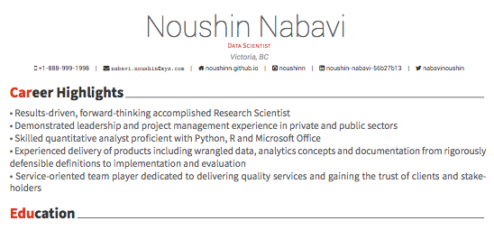

This is a template example for making a colorful curriculum vitae or résumé using RMarkdown and RStudio. You can use this template to use R and RMarkdown capabilities to make a fun curriculum vitae or résumé.

This template uses the [vitae](https://cran.r-project.org/web/packages/vitae/vignettes/vitae.html) library.

### Usage

Fork this [repo](https://github.com/NoushinN/resume) and edit the `make_resume.Rmd` in rmd_file folder.  

You can either edit the `make_resume.Rmd` file [directly in Github](https://github.com/NoushinN/resume/blob/main/rmd_file/make_resume.Rmd) or edit from your computer terminal in a RStudio IDE environment and render in PDF.   

An example is shown below:   

#### Author

Noushin Nabavi, PhD.  
[Twitter](http://twitter.com/nabavinoushin)  | [Github](http://github.com/NoushinN) | [Website](https://noushinn.github.io)  

##### License

[MIT License](https://github.com/NoushinN/resume/blob/main/LICENSE)